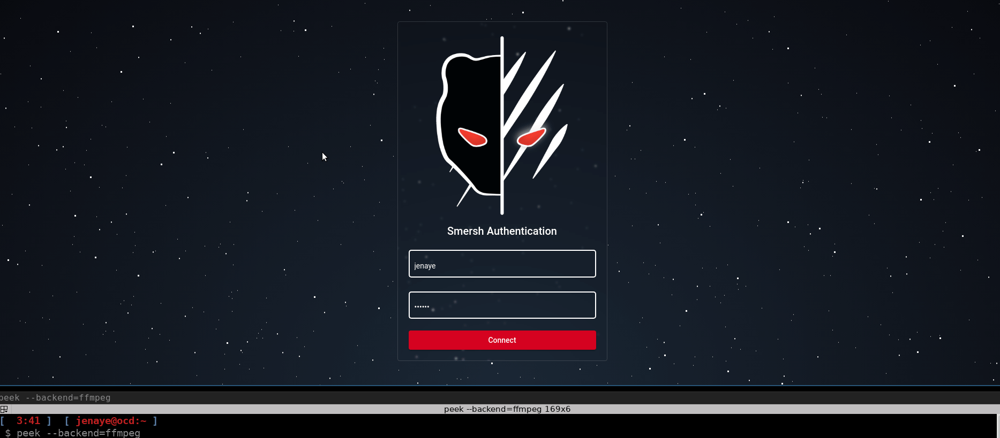

# SMERSH


[](https://inventory.raw.pm/tools.html#rawsec_cli)
[](https://img.shields.io/badge/Blackhat%20Arsenal-EUROPE%202021-blue)

<p align="center">

</p>

Smersh is a pentest oriented collaborative tool used to track the progress of your company's missions and generate rapport.

# Preview front (Angular):



# Documentation

All information is available at the following address: https://docs.smersh.app


# How to contribute ? 

Just *fork* repository then create branch, work and push your content + create PR

``` 
git checkout -b MyBranch
git add -p 
git commit -m "xx"
git push origin MyBranch
```

# Roadmap 
- Coming soon

# Contributors 

- darkweak - https://github.com/darkweak
- michmich1000 - https://michmich.eu
- SilouFr  - https://github.com/SilouFr
- sanchis  - https://github.com/sanchis
- RayMoDev  - https://github.com/RayMoDev
- Linda - https://github.com/proglin
- Log_s - https://rmrf-logs.com/man-log_s/
- Swiftoui - https://github.com/Swiftoui

# Official Discord Channel

[](https://discord.gg/sEkn3aa)
