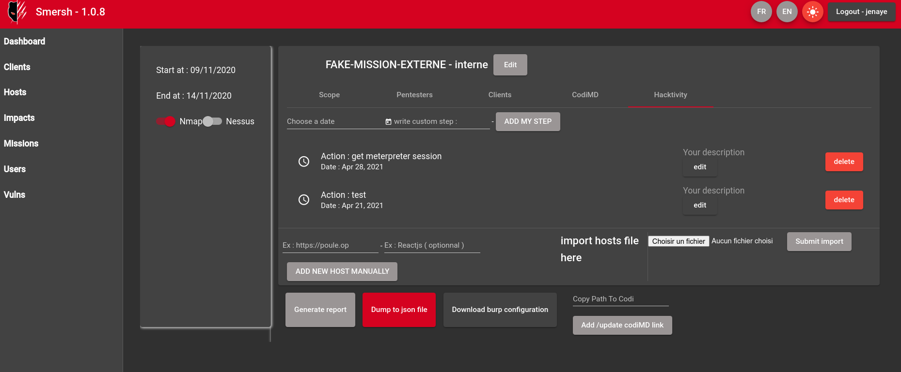

# SMERSH


<p align="center">

</p>


Smersh is a pentest oriented collaborative tool used to track the progress of your company's missions and generate rapport.

# Preview front (Angular):


## Search bar with dark theme


## Hacktivity tab




# preview API (Symfony + Api Platform) :


# Services
In Smersh we are using the environment variable called `DOMAIN` declared in the `.env` at the root folder of the project.  
You can override this variable as your own. Be sure to register the domain in your `/etc/hosts` that point to your local host.  
As we use [træfik](https://github.com/traefik/traefik) as reverse-proxy, you can refer to [their documentation](https://docs.traefik.io) to learn how to customize this instance.

| Container | Default DNS          |
| --------- | -------------------- |
| Api       | `api.{DOMAIN}`       |
| Bitwarden | `bitwarden.{DOMAIN}` |
| Client    | `{DOMAIN}`           |
| Db        | NOT EXPOSED          |
| php       | NOT EXPOSED          |
| CodiMD    | `codimd.{DOMAIN}`    |
| db-codiMD | NOT EXPOSED          |

# Preview Report


# How to install using docker

>requirements 
* Docker && docker-compose


>If you are using windows, please switch to linux </troll>

in `api` folder copy `.env-dist` to `.env` 

Run `make initialize` then go to `http://{DOMAIN}` and use "jenaye:jenaye" to log in.


# How to install server manualy
## You can also do it manualy like this :  

```
docker-compose up  # when build is done do the next command
docker-compose exec php bin/console do:da:cr  # create database
docker-compose exec php bin/console do:sc:up --force # generation of tables
docker-compose exec php bin/console make:entity --overwrite # 
docker-compose exec php bin/console doctrine:fixtures:load # load fake data
```

>For dummy data, think to edit files locate in `api/src/DataFixtures` and edit object.


## Generate keys ( jwt ) 

```
docker-compose exec php sh -c '                
    set -e
    apk add openssl
    mkdir -p config/jwt
    jwt_passphrase=${JWT_PASSPHRASE:-$(grep ''^JWT_PASSPHRASE='' .env | cut -f 2 -d ''='')}
    echo "$jwt_passphrase" | openssl genpkey -out config/jwt/private.pem -pass stdin -aes256 -algorithm rsa -pkeyopt rsa_keygen_bits:4096
    echo "$jwt_passphrase" | openssl pkey -in config/jwt/private.pem -passin stdin -out config/jwt/public.pem -pubout
    setfacl -R -m u:www-data:rX -m u:"$(whoami)":rwX config/jwt
    setfacl -dR -m u:www-data:rX -m u:"$(whoami)":rwX config/jwt
'
```


# How to install front manually

> requirements : node & npm 

```
cd client && npm i && npm start
```


# Variable into report

```
        startDate: # timestamp
        CLIENT_NAME: # String
        creds: # String
        classification: # String
        phone: # String
        version: # String
        by: # String
        to: # String
        authors: # Array
        state: # String
        scope # Array
``` 
### How to use it ? 

just edit function `doc.setData()` into `mission-single` component and define your element, after this update your template to use it like this 
`{VariableName}` and `{#MyArray}{MyUsername}{/MyArray}` if u need to loop on array

>The template are stored in `client/src/assets/Smersh.docx` you can also replace it by your template and use Smersh variable

# How to contribute ? 

Just *fork* repository then create branch, work and push your content + create PR

``` 
git checkout -b MyBranch
git add -p 
git commit -m "xx"
git push origin MyBranch
```

## How to use app localy while she's running on VPS

create file called `config` into `.ssh/` of your current user

then past the following content:

```
Host smersh
  Hostname <your-ip>
  Port <ssh-port>
  User <your-user>
  LocalForward 127.0.0.1:8000 127.0.0.1:8000
  LocalForward 127.0.0.1:4200 127.0.0.1:4200
  LocalForward 127.0.0.1:3000 127.0.0.1:3000
  LocalForward 127.0.0.1:8888 127.0.0.1:8888

``` 
then you can run `ssh smersh` and go to `http://{DOMAIN}`


## How to Make Backup of database

`docker-compose exec db pg_dump -U <User> <db> > smersh.sql`

## Tips for front-dev 

Run API using this command `docker-compose up api` then execute `cd client && npm i && npm start` 

## Run behat test 
```
make reset-db
docker-compose exec php sh
./vendor/bin/behat
```

>you can specify scenario like this `./vendor/bin/behat --name="Impact API testing"`


## Todo / ideas
- add conclusion generator
- Progress bar on mission ?
- Externe : host/vuln - interne : account pwned, privilieges ? perimeter
- Maybe use chips to create new vulns into host ?
- Add possibility to select impact when u're editing vuln
- add real fixture instead of dummy data
- parser gnmap
- different view for internal test and external
- add register page

## Contributors 
- Darkweak - https://github.com/orgs/CMEPW/people/Darkweak
- michmich1000 - https://michmich.eu
- SilouFr  - https://github.com/orgs/CMEPW/people/SilouFr
- sanchis  - https://github.com/sanchis
- RayMoDev  - https://github.com/RayMoDev
- Linda - https://github.com/proglin
- Log_s - https://rmrf-logs.com/man-log_s/

# Official Discord Channel

[](https://discord.gg/sEkn3aa)
