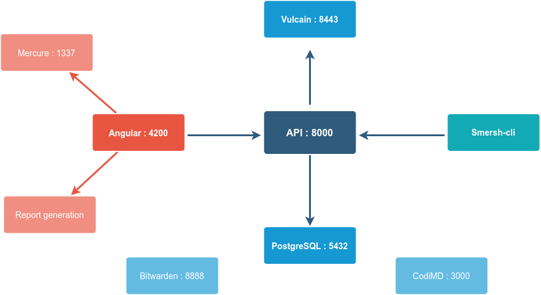
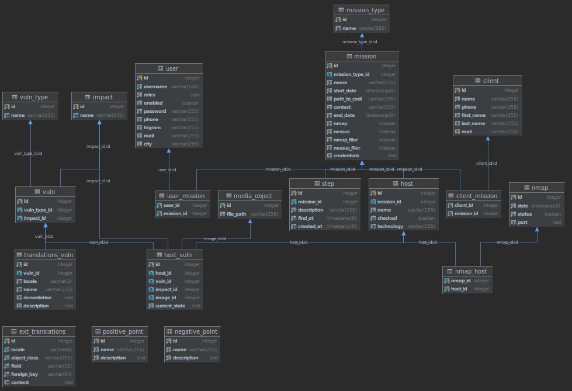

# Architecture

SMERSH uses many docker containers in its architecture, it means you have to allow few services, here is the complete list of ports to open. In addition, you will find on this page the schema composing the database.

## Ports mapping

| Container | Default DNS          |
| --------- | -------------------- |
| Api       | `api.{DOMAIN}`       |
| Bitwarden | `bitwarden.{DOMAIN}` |
| Client    | `{DOMAIN}`           |
| Db        | NOT EXPOSED          |
| php       | NOT EXPOSED          |
| CodiMD    | `codimd.{DOMAIN}`    |
| db-codiMD | NOT EXPOSED          |

## Database

Here is the organisation of the tables within the API

{ align=left }
