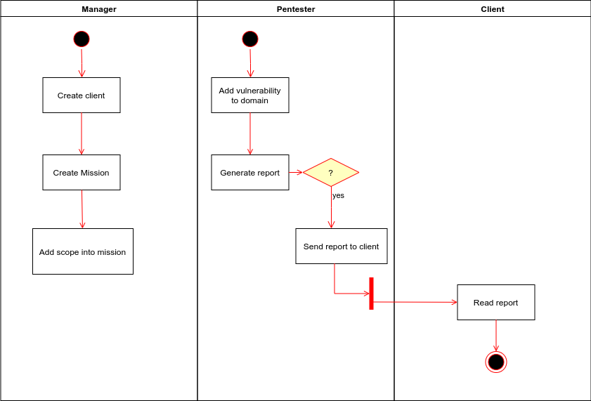

# Application lifecycle

{ width=80%, align=right }

SMERSH is designed in such a way that the manager prepares the mission, and the only task left is for the pentester to fill in the vulnerabilities found during the audit with.