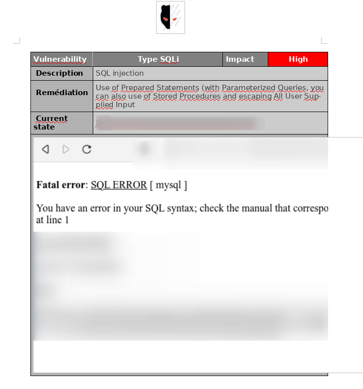

# Report

The report is generated on the client side through the [*docxtemplater*](https://www.npmjs.com/package/docxtemplater) library, the principle is simple, we pass him an object in the form of key/value.

All data is returned through the API so you can make a request on the url `http://localhost:8000/api/missions/<ID>` using your token. Everything happens at the level of [this code block](https://github.com/CMEPW/Smersh/blob/d5c6a4397a35d786c72395073ea8186659cd5188/client/src/app/components/mission-single/mission-single.component.ts#L428)


>For information this token can be retrieved through a get request on the entry point `authentication_token` and uses the settings username and password :


```c
curl --request POST \
  --url http://localhost:8000/authentication_token \
  --header 'Content-Type: application/json' \
  --data '{
	"username": "jenaye",
	"password": "jenaye"

}'
``` 

{ width=40%, height=20%, align=right }

## Where can I put my docx template ? 


You can move your template to the `clients/src/assets/` folder and rename it `Smersh.docx`.

>It is also possible to give it another name, however you will have to change the [following line](https://github.com/CMEPW/Smersh/blob/d5c6a4397a35d786c72395073ea8186659cd5188/client/src/app/components/mission-single/mission-single.component.ts#L422), then rebuild the container by typing `docker-compose up --build --force-recreate --remove-orphans client`

## Which variables are used ? 

Here is the list of all the variables that will be used to generate the report 

| startDate      | Start date of the mission                                                                                      |
|----------------|----------------------------------------------------------------------------------------------------------------|
| CLIENT_NAME    | Name of the customer                                                                                           |
| creds          | Bitwarden credentials  identifiers                                                                                  |
| classification | Type of report                                                                                                 |
| phone          | Phone number number                                                                                     |
| version        | Report version number                                                                                          |
| authors        |  List of pentesters assigned on the mission missioL                                                                 |
| state          | The status of the report                                                                                       |
| scope          | All the domain names and associated vulnerability as well as their criticality. |


For example, if you want to use the key `to` inside the report, change its value in the `data` object and then add this to the desired location `{to}`.